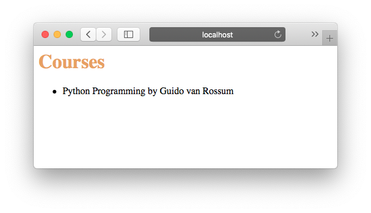

# Quickstart

This document will show you how to get a Bocadillo application up and running,
as well as provide you a good overview of Bocadillo's features.

::: tip
We'll assume you have Bocadillo installed already. If not, head to the [Installation] page!
:::

## Hello, world!

Here is a traditional "Hello, world!" example demonstrating
a minimal Bocadillo application:

<<<@/docs/getting-started/snippets/hello.py

If you've ever worked with [Flask], the API should look familiar.
Still, let's break this code down:

1. First, we import the `bocadillo` package.
2. Then, we create an `App` instance.
3. Next, we use the `@app.route()` decorator to tell Bocadillo to register the `index()` function at the root URL `/`. This operation is known as **routing**.
4. The `index()` function is a **view** — it takes a request and a response as arguments, and mutates the response as required (here, setting a `text` to be sent with it). This pattern is borrowed from [Falcon].
5. The last lines run the application server when the file is run as a script.

You can save this script somewhere, for example in a `hello.py` file.

To run your application, run the application script itself:

```bash
python hello.py
```

This launches a [Uvicorn] server for your application.

::: tip NOTE
Uvicorn is a very good development server. For production deployments, we recommend you check out their [deployment instructions](https://www.uvicorn.org/deployment/).
:::

You can now head to [http://localhost:8000](http://localhost:8000), and see "Hello, world!" printed on your screen! :tada:


## Feature tour

The following example is a courses management app.
It showcases a lot of Bocadillo's features: routing, views,
templates, hooks, and more.
You'll find a link to each feature's guide after the code.

Brace yourselves — fair chunk of code ahead!

::: tip
This code makes heavy use of type annotations. If you don't use them
yet, we recommend you read this article:
[The other (great) benefit of Python type annotations].
:::

<<<@/docs/getting-started/snippets/app.py

This is what `index.html` and `style.css` files look like:

<<<@/docs/getting-started/snippets/templates/index.html

<<<@/docs/getting-started/snippets/static/styles.css

To test this example, run the `app.py` script and access it in the browser.

You can also make some calls to the API endpoints.
We'll use the popular [Requests] library here.
For example, let's create a course:

```python
>>> import requests
>>> payload = {"name": "Python Programming", "teacher": "Guido van Rossum"}
>>> r = requests.post("http://localhost:8000/courses/", json=payload)
>>> assert r.status_code == 201
>>> r.json()
{'id': 1, 'name': 'Python Programming', 'teacher': 'Guido van Rossum'}
```

Now, let's make sure the course appears in the list:

```python
>>> r = requests.get("http://localhost:8000/courses/1")
>>> assert r.status_code == 200
>>> course = r.json()
>>> course
{'id': 1, 'name': 'Python Programming', 'teacher': 'Guido van Rossum'}
>>> r = requests.get("http://localhost:8000/courses/")
>>> assert course in r.json()
```

Nice! What happens if we retrieve a non-existing course?

```python
>>> r = requests.get("http://localhost:8000/courses/3")
>>> assert r.status_code == 404
>>> r.json()
{'error': 'Not Found', 'status': 404, 'message': 'Duh!'}
```

This is our custom error handler in action!

Finally, how about we check if all is well in the browser?



Cheers. :burrito:

## Next steps

Hopefully this quickstart guide gave you a hint of what Bocadillo has to offer.

Of course, we haven't dived into the details just yet.
You should now head to our [Guides] section to learn more.

As a starting point, here are the guides for the features showcased in
the courses app example:

- [Routes]
- [Views]
- [Templates]
- [CORS], [GZip] and [HSTS]
- [Static files]
- [Media]
- [Error handling]
- [Hooks]
- [Recipes]
- [WebSockets]
- [Middleware]

Happy coding!

[installation]: ./installation.md
[guides]: ../guides/
[uvicorn]: https://www.uvicorn.org
[flask]: http://flask.pocoo.org
[falcon]: https://falconframework.org
[requests]: http://docs.python-requests.org
[routes]: ../guides/http/routing.md
[views]: ../guides/http/views.md
[templates]: ../guides/agnostic/templates.md
[cors]: ../guides/http/middleware.md#cors
[hsts]: ../guides/http/middleware.md#hsts
[gzip]: ../guides/http/middleware.md#gzip
[static files]: ../guides/http/static-files.md
[media]: ../guides/http/media.md
[error handling]: ../guides/http/views.md#returning-errors
[hooks]: ../guides/http/hooks.md
[websockets]: ../guides/websockets
[middleware]: ../guides/http/middleware.md
[recipes]: ../guides/agnostic/recipes.md
[the other (great) benefit of python type annotations]: https://medium.com/@shamir.stav_83310/the-other-great-benefit-of-python-type-annotations-896c7d077c6b
