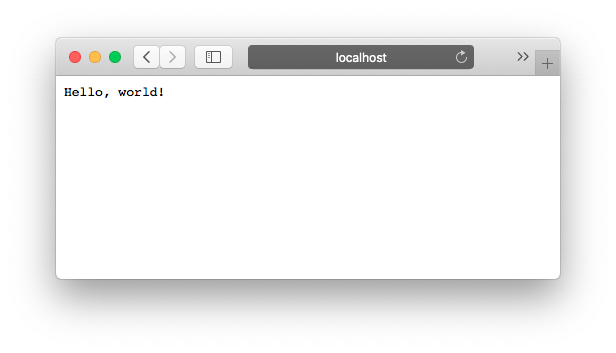

# Quickstart

Now that you've got Bocadillo [installed][installation], let's go through the traditional "Hello, world!" example. The purpose of this example is to demonstrate a minimal application and to run it.

[installation]: ./installation.md

Here you go:

<<<@/docs/getting-started/quickstart/hello.py

If you've ever worked with [Flask], the API should look familiar. Still, let's break this code down:

1. First, we import the `bocadillo` package.
2. Then, we create an `App` instance.
3. Next, we use the `@app.route()` decorator to tell Bocadillo to register the `index()` function at the root URL `/`. This operation is known as **routing**.
4. The `index()` function is a **view**. It is a coroutine function that takes a request and a response as arguments, and mutates the response as required — a pattern borrowed from [Falcon]. Here, we send a plain text response.
5. The last lines run the application server when the file is run as a script.

You can save this script somewhere, for example in a `hello.py` file.

To start the application server, run the application script itself:

```bash
python hello.py
```

This launches a [uvicorn] server for your application.

::: tip
If you want to see how this development setup can be scaled up to a production-grade setup, check out our [deployment instructions](https://www.uvicorn.org/deployment/).
:::

You can now head to [http://localhost:8000](http://localhost:8000), and see "Hello, world!" printed on your screen! :tada:



Carry on to the tutorial, in which we'll go on the journey of building a **chatbot server** with Bocadillo!

[uvicorn]: https://www.uvicorn.org
[flask]: http://flask.pocoo.org
[falcon]: https://falconframework.org
